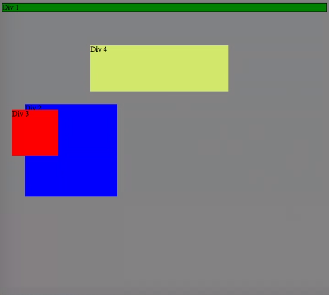
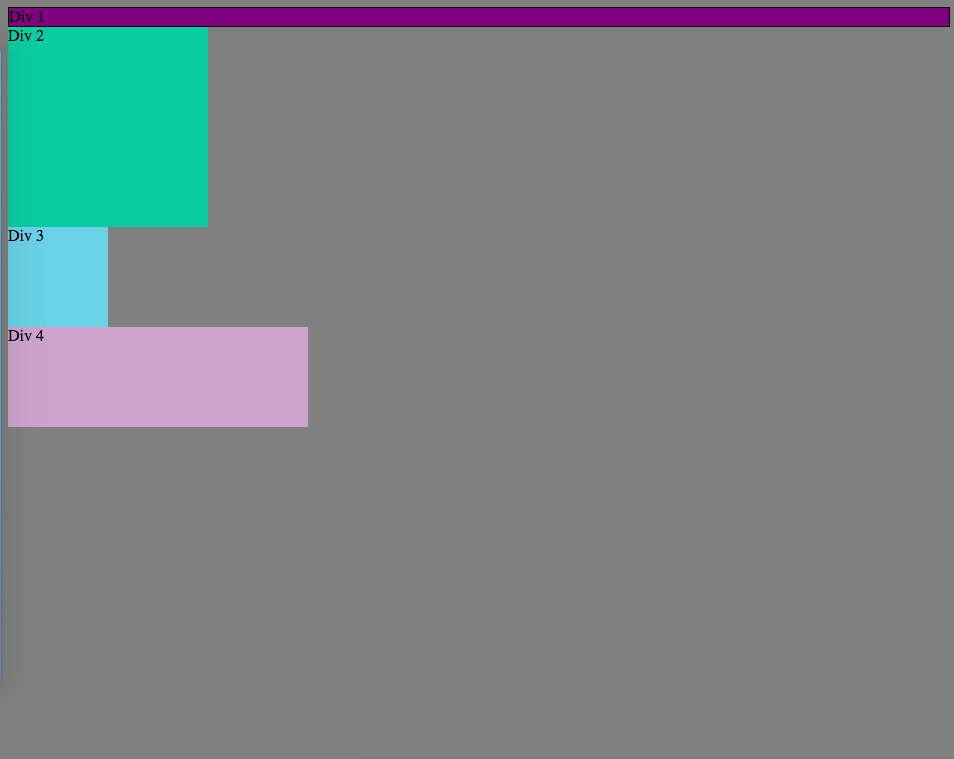
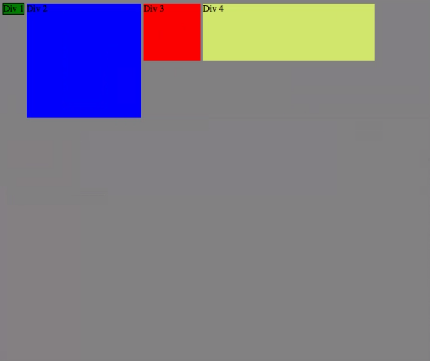
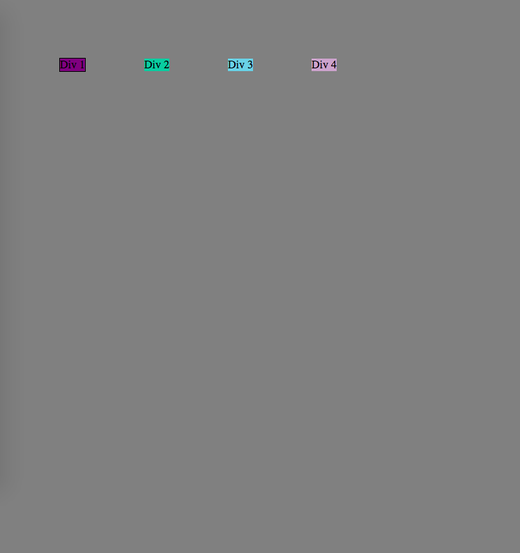
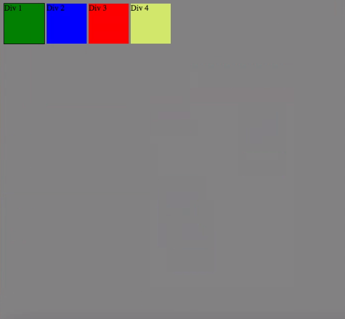
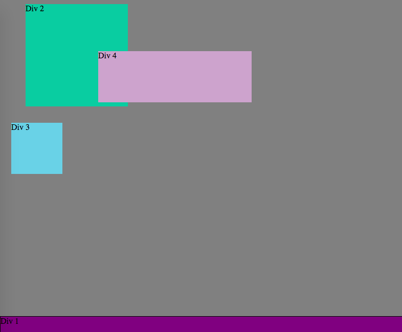
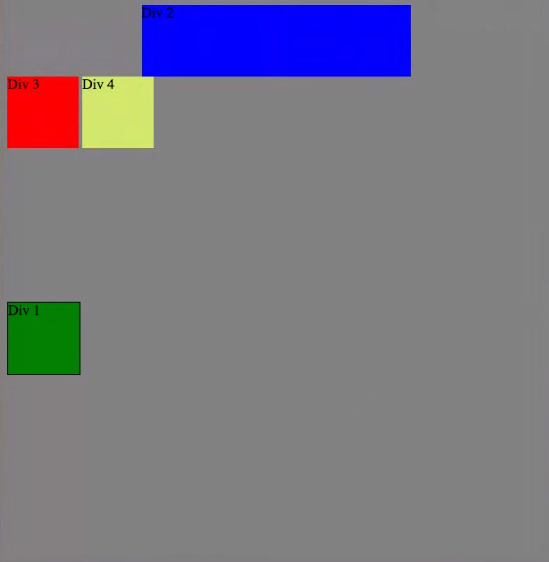
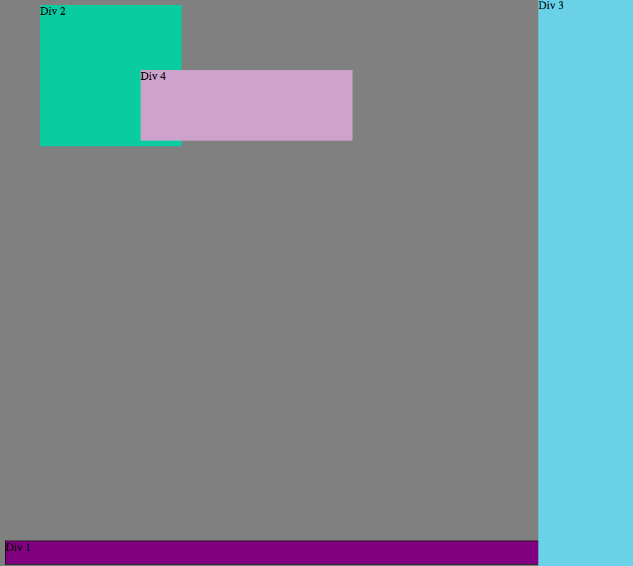
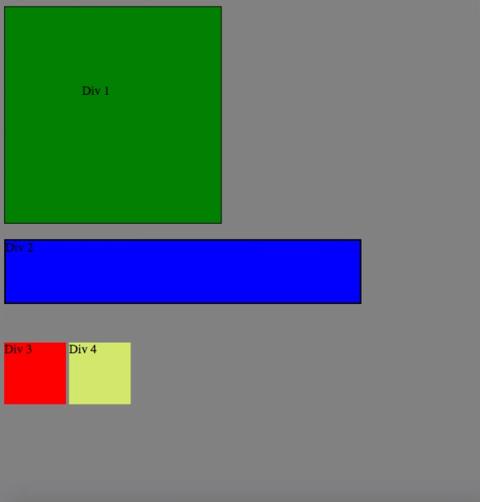

# 3.4 Chrome DevTools

#####1. How can you use Chrome's DevTools inspector to help you format or position elements?

With Chrome's DevTools, you can edit code and in real time see the changes that your edits have on the site. You can make quick changes to formatting or positioning of elements using trial and error.

#####2. How can you resize elements on the DOM using CSS?

You can simply change the CSS code on the DOM to resize elements, using the height and width properties. You can use px, em, or % for the height and width values.

#####3. What are the differences between absolute, fixed, static, and relative positioning? Which did you find easiest to use? Which was most difficult?

- *absolute:* The element does not make space for itself. It is positioned relative to its closest positioned element (in the HTML). It can have margins and does not collapse with other elements' margins.
- *static:* The element has normal behavior and stays in its current position. Top, bottom, right, and left properties don't apply. All elements have static as their default state.
- *fixed:* The element is positioned at a specified position relative to the screen's vierport and doesn't move when scrolled up or down. When it is printed, the element remains in the same fixed position on ever page.
- *relative:* All other elements are positioned, then the element's position is adjusted accordingly, without changing the layout. Changes to top, right, bottom, or left will move the element relative to its starting "normal" position.

I found absolute to be the easiest to use and fixed to be the most difficult.

#####4. What are the differences between margin, border, and padding?

Margin refers to the area outside the space of the object. Padding refers to the area inside the space of the object, between whatever is written and the edge of the object. Border is what goes around the edges of the object.

#####5. What was your impression of this challenge overall? (love, hate, and why?)

This challenge was a little bit hard to complete as a pair since it involved a lot of very simple trial and error with the source code. The person driving can quickly click and unclick boxes to see what happens, faster than the navigator can suggest it. Also, my internet connection was not good during the challenge and this made everything drag out.